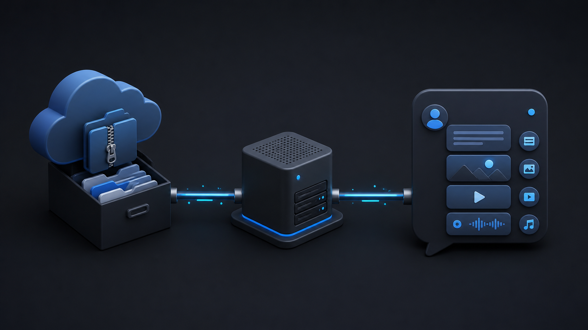

<p align="center">
  
</p>

<h1 align="center">VK Content Bot</h1>

<p align="center">
  VK-бот для выдачи текста, медиа и кнопок по ключевым фразам.
</p>

<p align="center">
  
  
  
  
</p>

Редактор меняет ключевые слова, тексты, файлы, fallback и кнопки в Directus. Пересобирать бота для нового контента не нужно.

Общая CMS и её PostgreSQL/Redis не входят в этот репозиторий. Ими владеет [`bot-platform-infra`](https://github.com/Evgenykravchenko/bot-platform-infra).

## Как это работает

```text
Пользователь VK
       │
       ▼
VK Content Bot ──► Directus CMS ──► ответ, блоки, кнопки
       │
       └──► VK API

Яндекс Диск ──► media worker ──► VK attachment ID ──► Directus CMS
```

Файл с Яндекс Диска передаётся во VK один раз. После этого бот использует сохранённый VK ID и не скачивает оригинал на каждый запрос.

## Возможности

- точное совпадение, фраза внутри сообщения, любое или все слова;
- приоритеты правил и нормализация текста;
- текст, фото, видео, аудио и документы в любом порядке;
- inline-кнопки команд и ссылок;
- полноценный fallback-ответ;
- фоновая подготовка закрытых файлов с Яндекс Диска;
- изоляция контента по `CONTENT_BOT_KEY`;
- кеш правил, structured logging и graceful shutdown.

> **Наполняете CMS?** Откройте единую [инструкцию редактора](docs/CONTENT_GUIDE.md): в ней объяснён каждый раздел и собраны готовые примеры текста, медиа, кнопок и fallback.

## Локальная разработка

Сначала запустите CMS из соседнего репозитория:

```bash
cd ../bot-platform-infra
cp .env.example .env
docker compose --env-file .env -f compose.yaml -f compose.local.yaml up -d
```

Затем запустите бота:

```bash
cp .env.example .env
# заполните VK_TOKEN, Directus token и остальные значения
docker compose up -d --build bot
docker compose logs -f bot
```

Для запуска без Docker замените `DIRECTUS_URL` на `http://localhost:8055`, затем:

```bash
npm ci
npm run dev
```

## Проверки

```bash
npm run format:check
npm run lint
npm run typecheck
npm test
npm run build
docker build --target runtime .
```

CI выполняет эти проверки для push и pull request, а также собирает ARM64-образ.

## Конфигурация

| Переменная                | Назначение                                          |
| ------------------------- | --------------------------------------------------- |
| `VK_TOKEN`                | Токен сообщества VK                                 |
| `VK_GROUP_ID`             | Числовой ID сообщества                              |
| `VK_MEDIA_UPLOAD_PEER_ID` | ID аккаунта для загрузки фото и документов          |
| `CONTENT_BOT_KEY`         | Какое контентное пространство CMS использовать      |
| `DIRECTUS_URL`            | Внутренний URL Directus                             |
| `DIRECTUS_TOKEN`          | Токен чтения и подготовки медиа                     |
| `YANDEX_DISK_TOKEN`       | OAuth-токен Диска; можно оставить пустым для текста |
| `RULE_CACHE_TTL_SECONDS`  | Кеш ключевых правил, по умолчанию 30 секунд         |

Полный список есть в [.env.example](.env.example).

## Релизы

В репозитории приняты Conventional Commits и SemVer:

- `fix:` → patch;
- `feat:` → minor;
- `feat!:` или `BREAKING CHANGE:` → major.

Workflow `Release` принимает новую SemVer-версию, собирает образы, создаёт tag и GitHub Release с автоматическими notes:

```text
ghcr.io/evgenykravchenko/vk-content-bot:0.2.0
ghcr.io/evgenykravchenko/vk-content-bot:0.2
```

Production фиксирует точную версию. `latest` не используется. Порядок выкатки и rollback: [docs/PRODUCTION.md](docs/PRODUCTION.md).

## Структура

```text
src/                     бизнес-логика и интеграции
tests/                   unit-тесты
deploy/                  безопасный пример production env
scripts/                 deployment и healthcheck
docs/                    инструкции
.github/workflows/       CI, release, image publish, deploy
compose.yaml             локальный запуск
compose.production.yaml  production override
```

## Приватность медиа

Бот не публикует материалы на стене. Для видео используются `wallpost: 0`, `is_private: 1` и отключённые комментарии. Уже полученный файл пользователь всё равно может переслать или записать с экрана: это не DRM.

MIT License.
