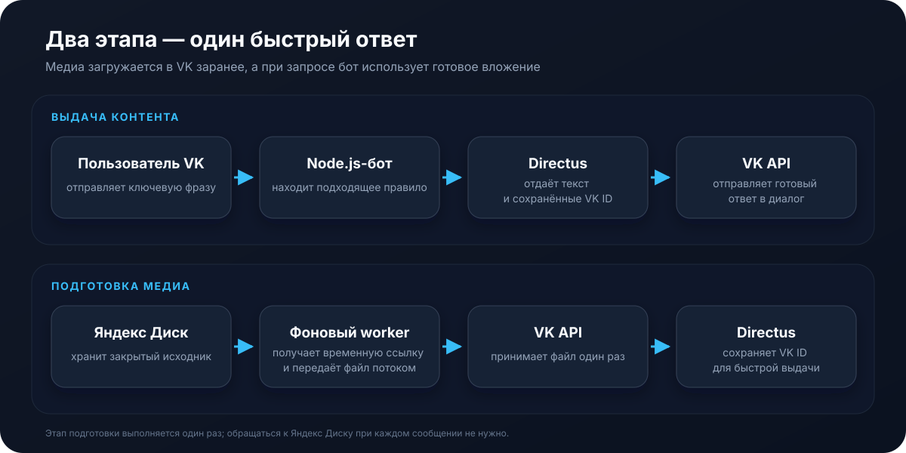
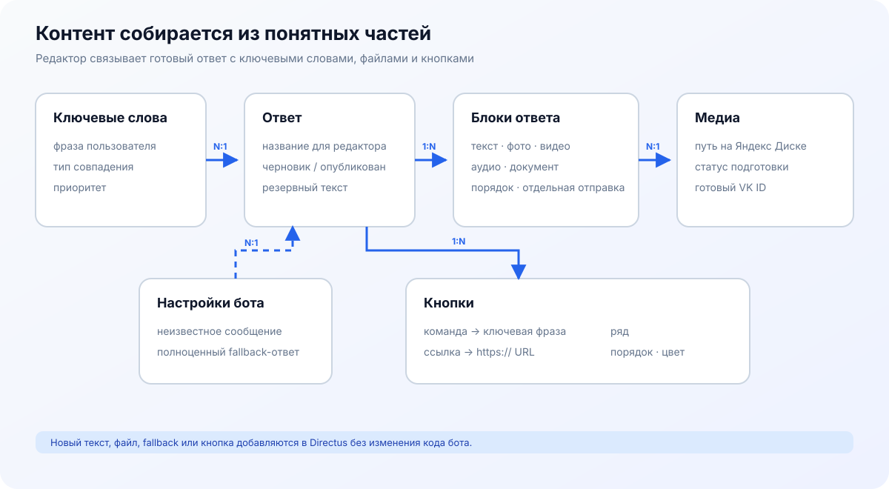

<p align="center">
  
</p>

<h1 align="center">VK Content Bot</h1>

<p align="center">
  Бот сообщества VK, который выдаёт управляемые наборы текста и медиа по ключевым словам.
</p>

<p align="center">
  
  
  
  
  
</p>

Контент живёт отдельно от кода. Редактор работает в Directus: добавляет ключевые фразы, собирает ответы из блоков и связывает их с файлами на Яндекс Диске. Тяжёлый файл передаётся во VK один раз. При последующих запросах бот отправляет уже готовый идентификатор вложения.

Проект ничего не публикует на стене сообщества и не скачивает ролик с Яндекс Диска при каждом сообщении пользователя.

## Как это устроено

<p align="center">
  
</p>

В проекте два этапа:

1. **Подготовка медиа.** Редактор переводит материал в статус `queued`. Фоновый обработчик получает временную ссылку Яндекс Диска, передаёт файл в загрузчик VK и записывает полученный `vk_attachment` в Directus.
2. **Выдача.** Бот нормализует сообщение, выбирает правило с наивысшим приоритетом, получает блоки ответа и отправляет сохранённые VK-вложения. Яндекс Диск в этом контуре не участвует.

<p align="center">
  
</p>

Один ответ может выглядеть как угодно: текст и фотография одним сообщением, отдельный ролик следом, несколько документов или только текст. Под последним сообщением можно разместить inline-кнопки. Всё это собирается в Directus без изменения кода.

## Что уже реализовано

- точное совпадение, поиск фразы, совпадение по любому или по всем словам;
- приведение регистра, `ё → е`, очистка пунктуации и лишних пробелов;
- приоритет правил и разрешение конфликтов по длине фразы;
- ответы из текста, фотографий, видео, аудиофайлов и документов;
- inline-кнопки-команды и кнопки-ссылки, настраиваемые в Directus;
- фоновая подготовка файлов с Яндекс Диска;
- сохранение VK ID, чтобы не загружать один файл повторно;
- статусы `draft → queued → processing → ready/error`;
- кеш правил с защитой от параллельного обновления;
- автоматическое создание структуры Directus и тестового ответа `помощь`;
- корректная остановка контейнера по `SIGTERM`;
- unit-тесты сопоставления и сборки ответов.

## Что потребуется от вас

### 1. Docker

Установите [Docker Desktop](https://www.docker.com/products/docker-desktop/) или Docker Engine с Compose. Локально устанавливать Node.js, PostgreSQL и Redis не требуется.

Проверка:

```bash
docker compose version
```

### 2. Сообщество VK

Потребуются три вещи:

- числовой ID сообщества;
- числовой ID личного аккаунта для технической загрузки медиа;
- токен сообщества с доступом к сообщениям и загрузке используемых типов вложений.

В сообществе откройте **Управление → Работа с API → Ключи доступа** и создайте ключ. Затем включите сообщения сообщества и Long Poll API, а среди событий отметьте `Входящее сообщение` (`message_new`).

`VK_MEDIA_UPLOAD_PEER_ID` — ID вашего личного VK-аккаунта. Этот аккаунт должен хотя бы один раз написать сообществу. VK требует `peer_id`, когда бот заранее загружает фотографии и документы. Число берётся из ссылки вашей страницы `vk.com/id123456789` без `id`.

Токен начинается примерно так: `vk1.a...`. Его нельзя отправлять в чат, добавлять в README или коммитить в Git.

### 3. Токен Яндекс Диска

Он нужен только обработчику медиа. Текстовые ответы работают и без него.

Создайте OAuth-приложение в [Яндекс OAuth](https://oauth.yandex.ru/client/new), разрешите чтение файлов Диска и получите пользовательский OAuth-токен. Общий порядок описан в [документации REST API Диска](https://yandex.ru/dev/disk-api/doc/ru/).

Бот получает доступ только с сервера. Папку с материалами публиковать не нужно.

### 4. Секреты Directus и PostgreSQL

Сгенерируйте два случайных значения:

```bash
openssl rand -hex 32
openssl rand -hex 32
```

Одно используйте как `DIRECTUS_SECRET`, второе как `DIRECTUS_TOKEN`. Для паролей Directus и PostgreSQL задайте собственные длинные значения.

## Первый запуск

Перейдите в папку проекта и создайте рабочий `.env`:

```bash
cp .env.example .env
```

Заполните как минимум:

```dotenv
VK_TOKEN=токен_сообщества
VK_GROUP_ID=числовой_id
VK_MEDIA_UPLOAD_PEER_ID=id_личного_аккаунта

DIRECTUS_ADMIN_EMAIL=ваша_почта
DIRECTUS_ADMIN_PASSWORD=длинный_пароль
DIRECTUS_TOKEN=случайная_строка
DIRECTUS_SECRET=другая_случайная_строка

POSTGRES_PASSWORD=ещё_один_пароль

YANDEX_DISK_TOKEN=oauth_токен_яндекса
```

Запустите стек:

```bash
docker compose up -d --build
```

Проверьте состояние:

```bash
docker compose ps
docker compose logs -f bot
```

Directus откроется по адресу [http://localhost:8055](http://localhost:8055). Войдите с `DIRECTUS_ADMIN_EMAIL` и `DIRECTUS_ADMIN_PASSWORD`.

При первом запуске контейнер `cms-bootstrap` создаст пять коллекций и демонстрационную команду `помощь`. Его состояние `Exited (0)` после инициализации — нормальное поведение.

## Как добавить первый ответ

### Только текст

1. В Directus откройте `responses` и создайте ответ со статусом `published`.
2. В `response_blocks` добавьте блок:
   - `response` — созданный ответ;
   - `kind` — `text`;
   - `body` — текст сообщения;
   - `sort` — `10`;
   - `enabled` — включено.
3. В `keywords` создайте правило, укажите фразу и свяжите её с ответом.
4. Подождите до 30 секунд, пока обновится кеш, или перезапустите контейнер бота.

### Видео с Яндекс Диска

Допустим, ролик лежит по пути:

```text
/VK Bot/catalog/welcome.mp4
```

1. Создайте запись в `media_assets`:
   - `name` — `Приветственное видео`;
   - `kind` — `video`;
   - `yandex_path` — `/VK Bot/catalog/welcome.mp4`;
   - `status` — сначала `draft`.
2. Сохраните запись и смените статус на `queued`.
3. Worker переведёт её в `processing`, затем в `ready` и заполнит `vk_attachment`.
4. Добавьте в `response_blocks` блок типа `video` и выберите подготовленный материал.

При ошибке статус станет `error`, а причина появится в `error_message`. Исправьте путь или доступ, затем снова установите `queued`.

### Текст, фото и кнопки

Добавьте к одному ответу два блока: текстовый с `sort = 10` и блок фото с `sort = 20`. Оставьте `send_separately` выключенным — тогда текст и фотография уйдут одним сообщением.

В `response_buttons` создайте кнопку и выберите тот же ответ:

- `label` — видимая подпись, например `Ещё котика 😺`;
- `action = text` — кнопка-команда;
- `target` — ключевая фраза другого ответа, например `кот дня`;
- `color` — синий, серый, зелёный или красный;
- `row_number` — ряд от 1 до 6;
- `sort` — порядок внутри ряда;
- `enabled` — включено.

Для ссылки выберите `action = open_link`, а в `target` укажите полный `https://`-адрес. Кнопка-ссылка всегда занимает отдельный ряд. В одном ряду может быть до пяти кнопок-команд.

## Режимы совпадения

| Режим       | Ключевая фраза   | Сообщение                  | Результат  |
| ----------- | ---------------- | -------------------------- | ---------- |
| `exact`     | `прайс`          | `прайс`                    | совпадение |
| `exact`     | `прайс`          | `покажи прайс`             | нет        |
| `contains`  | `покажи прайс`   | `пожалуйста, покажи прайс` | совпадение |
| `any_word`  | `цены стоимость` | `какая стоимость`          | совпадение |
| `all_words` | `новый каталог`  | `покажи новый каталог`     | совпадение |

Если подходят несколько правил, бот сначала смотрит на `priority`, затем выбирает более длинную ключевую фразу.

## Конфигурация

| Переменная                    | Назначение                                       | Обязательна |
| ----------------------------- | ------------------------------------------------ | ----------- |
| `VK_TOKEN`                    | Токен сообщества VK                              | да          |
| `VK_GROUP_ID`                 | Числовой ID сообщества                           | да          |
| `VK_MEDIA_UPLOAD_PEER_ID`     | ID аккаунта для подготовки медиа                   | да          |
| `DIRECTUS_URL`                | Внутренний адрес API Directus                    | да          |
| `DIRECTUS_PUBLIC_URL`         | Адрес Directus для браузера                      | да          |
| `DIRECTUS_TOKEN`              | Статический токен первоначального администратора | да          |
| `DIRECTUS_SECRET`             | Подпись сессий Directus                          | да          |
| `YANDEX_DISK_TOKEN`           | OAuth-токен Диска                                | для медиа   |
| `RULE_CACHE_TTL_SECONDS`      | Время жизни кеша правил                          | нет, `30`   |
| `MEDIA_POLL_INTERVAL_SECONDS` | Интервал проверки очереди                        | нет, `20`   |
| `MEDIA_BATCH_SIZE`            | Файлов за одну итерацию                          | нет, `3`    |
| `LOG_LEVEL`                   | Уровень логирования                              | нет, `info` |

`YANDEX_DISK_ROOT` оставлен в конфигурации для будущего ограничения рабочей папки. Сейчас в CMS указывается полный путь к файлу.

## Команды

```bash
# Запуск
docker compose up -d --build

# Логи бота
docker compose logs -f bot

# Логи Directus
docker compose logs -f directus

# Повторная идемпотентная инициализация CMS
docker compose run --rm cms-bootstrap

# Unit-тесты в отдельном build-слое
docker compose run --rm checks

# Типы и линтер
docker compose run --rm checks npm run typecheck
docker compose run --rm checks npm run lint

# Остановка без удаления данных
docker compose down
```

Не используйте `docker compose down -v`, если хотите сохранить базу Directus: ключ `-v` удаляет именованные тома PostgreSQL и Redis.

## Структура проекта

```text
vk-content-bot/
├── src/
│   ├── config/              # переменные окружения и логирование
│   ├── domain/              # сопоставление, типы и сборка сообщений
│   ├── services/            # Directus, Яндекс Диск и media worker
│   ├── app.ts               # обработчики VK
│   └── index.ts             # точка входа и graceful shutdown
├── scripts/
│   └── bootstrap-directus.mjs
├── tests/
├── directus/
├── docs/assets/
├── compose.yaml
└── Dockerfile
```

## Приватность контента

Исходники на Яндекс Диске остаются закрытыми. Бот использует OAuth и временную ссылку для передачи файла. Ссылка не сохраняется в Directus.

При подготовке видео выставляются `wallpost: 0`, `is_private: 1` и отключаются комментарии. Однако вложение, уже выданное пользователю, можно переслать или записать с экрана. Этот проект скрывает материал от публичной стены и каталога, но не является DRM-системой.

Для платного контента стоит дополнительно хранить права пользователей и проверять их перед каждой выдачей.

## Диагностика

### `cms-bootstrap` завершился с ошибкой

Посмотрите журнал:

```bash
docker compose logs cms-bootstrap
```

Чаще всего причина — пустой `DIRECTUS_TOKEN`, изменение токена после первого запуска или неготовая база.

### Материал остаётся в `queued`

Проверьте:

- заполнен ли `YANDEX_DISK_TOKEN`;
- перезапущен ли контейнер после изменения `.env`;
- существует ли точный путь на Диске;
- есть ли у OAuth-приложения право чтения;
- журнал `docker compose logs -f bot`.

### Бот не видит сообщения

Убедитесь, что сообщения сообщества включены, Long Poll API активен и событие `message_new` разрешено. Также проверьте, что `VK_TOKEN` создан именно для нужного сообщества.

### Изменения в Directus появились не сразу

Правила кешируются на время `RULE_CACHE_TTL_SECONDS`. По умолчанию это 30 секунд. Готовые блоки ответа читаются после выбора правила, поэтому правка текста обычно видна сразу.

## Перед публичным развёртыванием

- поставьте Directus за HTTPS reverse proxy;
- закройте порт PostgreSQL от внешней сети;
- ограничьте доступ к админке;
- создайте отдельного пользователя Directus с правами только на чтение контента и обновление `media_assets`;
- настройте резервное копирование PostgreSQL;
- вынесите секреты из `.env` в менеджер секретов;
- добавьте мониторинг ошибок и свободного места Docker.

Сейчас бот использует статический токен первоначального администратора, чтобы локальный запуск был воспроизводимым. Для домашнего сервера это удобно; для публичного production-сервера лучше перейти на отдельную сервисную учётную запись с минимальными правами.

## Лицензия

Проект распространяется по лицензии [MIT](LICENSE). Вы можете использовать, изменять и распространять код при сохранении текста лицензии и уведомления об авторских правах.
